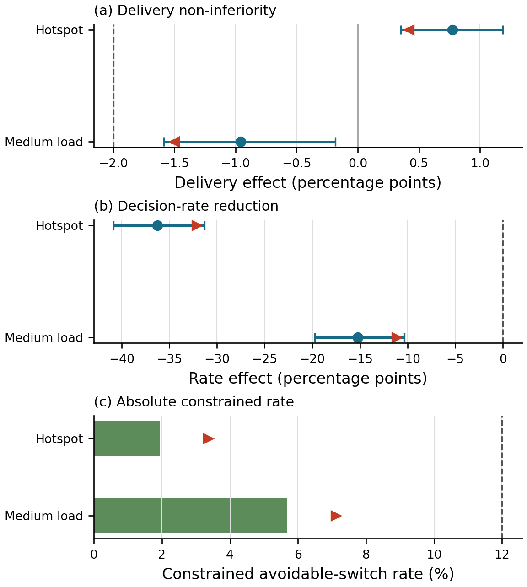

# LEO Routing with Constraint-Aware MAPPO

这个仓库研究动态 LEO 星座中的分布式下一跳路由。每颗卫星作为一个 agent，使用共享参数的候选邻居 Actor 做本地决策；训练阶段使用图 Critic，部署阶段只需要本地包状态、缓存下一跳和一跳链路/队列信息。

当前主线不是继续堆奖励项，而是直接约束“本来可以不换路、但策略仍然换了下一跳”的决策。代码、训练协议、经典基线和一次性 sealed test 都已经冻结。

## 当前结果

正式实验包含两个 24 星场景、3 个 MAPPO 方法、3 个经典方法、8 个独立 policy seed 和 50 个未见 workload。sealed panel 共 4,100 行，没有缺失或重复。

主比较是 `qos_only_constrained` 相对同奖励、同结构的 `qos_only_baseline`：

| 场景 | 投递率差值 | 95% CI | 可避免切换率差值 | 95% CI |
|---|---:|---:|---:|---:|
| `medium_load` | -0.958 pp | [-1.587, -0.182] pp | -15.219 pp | [-19.739, -10.357] pp |
| `hotspot_high_load` | +0.772 pp | [+0.353, +1.188] pp | -36.245 pp | [-40.872, -31.305] pp |

两个场景都通过了预先写定的四个门限：

- 投递率单侧 95% 下界不低于 -2 pp；
- 可避免切换率差值的单侧上界低于 0；
- constrained 策略的切换率单侧上界不高于 12%；
- 每个 policy seed 的切换率都不高于 12%。

中负载并不是“无损提升”：投递率下降约 0.96 pp，只是仍在预设的 2 pp non-inferiority 容差内。热点场景下 constrained MAPPO 的投递率也低于 Q-routing（0.2945 对 0.3114）。仓库和论文都保留这两个结果。



## 方法

### 决策级可避免切换

对每个 contention 之前的有效路由决策：

```text
o = 1  当缓存下一跳和至少一个替代下一跳都可行
c = 1  当 o = 1 且策略选择了不同下一跳
R = sum(c) / sum(o)
```

首次选路、缓存链路已经失效后的强制切换、`NO_OP` 和 padding 都不进入分子。计数发生在 contention 之前，因此不会因为后续链路竞争失败而漏掉策略已经提出的切换。

### Candidate-set MAPPO

- 26 维候选特征，覆盖队列、链路状态、几何进展、包上下文和缓存信息；
- 共享候选编码器和对称池化，候选顺序变化只会重排 logits；
- 不可行动作在采样前 mask；
- 图 Critic 只在 centralized training 中使用；
- team reward 加零均值 local credit；
- PPO 使用 GAE、value clipping、可行动作归一化 entropy 和 KL 约束。

约束臂的 Actor loss 为：

```text
L_actor = L_PPO + lambda * C_surrogate

lambda_next = clip(lambda + 0.05 * (R_rollout - 0.12), 0, 5)
```

`lambda` 每个完整 rollout 更新一次。它是经验约束控制器，不是 CPO，也不提供逐轨迹的硬保证。

## 实验设计

| 项目 | 设置 |
|---|---|
| 星座 | 4 planes x 6 satellites |
| 场景 | `medium_load`, `hotspot_high_load` |
| MAPPO arms | QoS baseline, constrained, reward-shaped control |
| Policy seeds | 每个 arm/scenario 8 个 |
| 训练预算 | 50,000 target steps，实际完整 rollout 边界 50,040 |
| 训练 workloads | 76001--76200 |
| checkpoint selection | 77001--77010 |
| independent gate | 77011--77020 |
| sealed test | 78001--78050，只实例化一次 |
| 经典基线 | Q-routing, OSPF-ECMP, Global Dijkstra |

Q-routing 每个场景、每个 policy identity 重新训练 500 episodes。OSPF-ECMP 使用 8 个路由随机身份；Global Dijkstra 是确定性的，只使用一个 sentinel identity。

统计推断以 policy seed 为独立单位，不把 50 个 workload 当成 50 次独立训练。置信区间使用 5,000 次 crossed bootstrap，同时重采样 seed 行和 workload 列；敏感性检验枚举 `2^8` 个 sign flips，并对四个主检验做 Holm 校正。

## 仓库结构

```text
src/          环境、MAPPO、基线、统计、实验 runner 和测试
docs/         预注册协议、修订记录和 claim boundary
experiments/  紧凑结果、冻结文件和公开的 sealed rows
figures/      历史实验图表
paper/        ICC 2027 草稿、图和参考文献
data/         TLE 与导出的 24 星拓扑
```

这次正式结果对应：

```text
experiments/avoidable-switch-constraint-formal-v1-r2/
experiments/avoidable-switch-classical-baselines-formal-v1-r3/
experiments/avoidable-switch-joint-sealed-test-v1/
```

前两个目录在 GitHub 中只保留顶层 preregistration、aggregate rows、statistics 和 freeze。训练 checkpoint、逐 job 状态、重复 JSONL 和运行日志留在本地，不进入 Git。sealed test 的公开数据以 `sealed_test_rows.csv` 为准。

## 安装

Python 3.10 或 3.11 均可。PyTorch/CUDA 版本请按本机驱动选择，其余依赖：

```bash
python -m venv .venv
source .venv/bin/activate       # Windows PowerShell: .venv\Scripts\Activate.ps1
pip install -r requirements.txt
```

MAPPO trainer 目前通过 CleanMARL 兼容入口运行。正式训练 runner 会记录源码、依赖、CUDA 设备和 checkpoint hash；不要直接修改已冻结目录继续训练。

## 测试

在仓库根目录执行：

```bash
cd src
python -m unittest discover -p "test_*.py"
```

只检查本次 constraint/sealed-test 链路：

```bash
cd src
python -m unittest \
  test_avoidable_switch_constraint \
  test_avoidable_switch_constraint_formal \
  test_formal_avoidable_switch_statistics \
  test_avoidable_switch_classical_baselines_formal \
  test_avoidable_switch_joint_sealed_test
```

sealed workloads 已经按协议使用过一次。不要删除输出目录后重新跑 test panel，也不要用 test 结果重新选 seed、checkpoint 或场景。公开结果的只读入口是：

```text
experiments/avoidable-switch-joint-sealed-test-v1/sealed_test_statistics.json
experiments/avoidable-switch-joint-sealed-test-v1/sealed_test_rows.csv
```

## 冻结记录

```text
MAPPO training freeze
153b5cd85305f3f4c9a03fd549eea3e06785a0d1a447b96ec9005098c7d25742

MAPPO validation freeze
d3c039657802e9c784c82cec31024e5098b31e5a3e217e69bbc64dad5a8469d6

Classical training freeze
df7cf104d30360df898ef8239b64789c16e0baa9e87c78c52c08a676ecb62eba

Classical gate freeze
36bac779a6961ce38eb6872ec0f9cfa3953898ceb00d9b5bd7f10ce80fbc3a1e

Joint sealed-test authorization
9e2c173b0399adf52adeb575ffb11742d2c3452eb0d50bb6bdccdac22ceed653

Final sealed-test freeze
c5cc82c7edb96add6e8da1275924e83cf159e65a2062184d52f3364ad8e508a9
```

协议细节见：

- [`docs/AVOIDABLE_SWITCH_CONSTRAINT_FORMAL_V1.md`](docs/AVOIDABLE_SWITCH_CONSTRAINT_FORMAL_V1.md)
- [`docs/AVOIDABLE_SWITCH_CLASSICAL_BASELINES_FORMAL_V1.md`](docs/AVOIDABLE_SWITCH_CLASSICAL_BASELINES_FORMAL_V1.md)
- [`docs/AVOIDABLE_SWITCH_JOINT_SEALED_TEST_V1.md`](docs/AVOIDABLE_SWITCH_JOINT_SEALED_TEST_V1.md)

## 结果边界

目前证据支持的说法很具体：在这个 24 星 slot simulator 的两个已测试负载场景中，显式 decision-level constraint 相对匹配的 QoS-only MAPPO 大幅降低了可避免切换率，并通过预设的投递率 non-inferiority 门限。

它还不能说明：

- 对任意 LEO 星座和流量都有效；
- 优于所有经典路由方法；
- 已经验证控制面收敛或真实信令开销；
- 能零样本扩展到大星座；
- 已达到工程部署条件。

下一步更有价值的是在 TLE/SGP4 或 Hypatia/ns-3 环境中做独立外部验证，而不是继续调整这次 sealed result。
